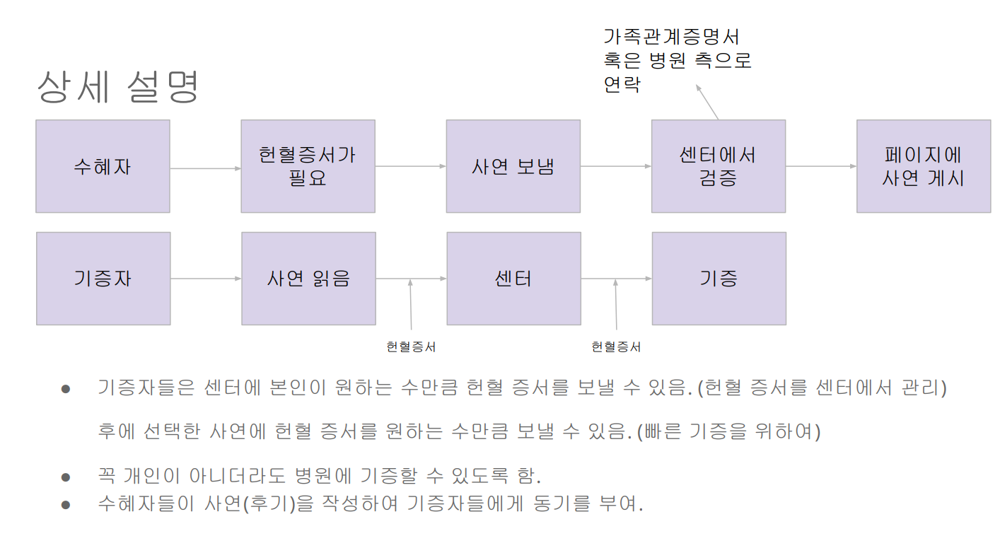
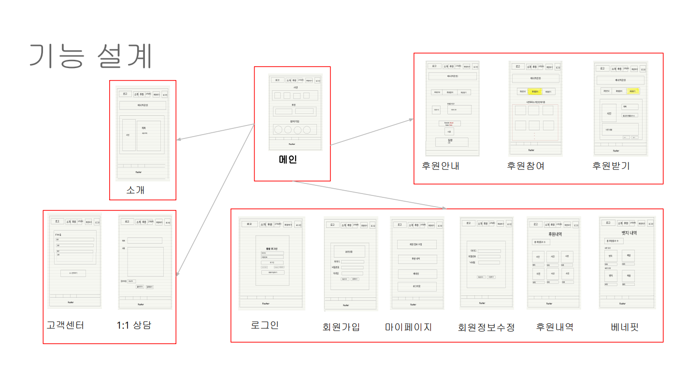
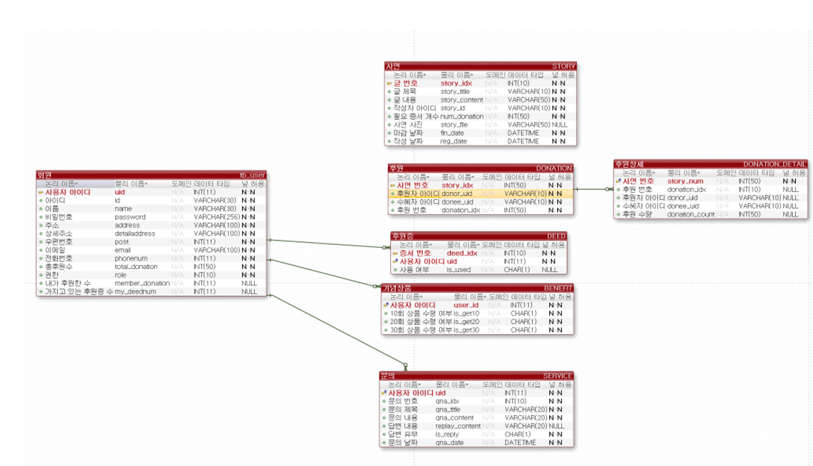

# 헌혈증서 기부 사이트

## 시연 영상

## 기술 스택
|기술명|버전|
|------|---|
|Vue|2|
|npm|6.14.15|
|node|14.18.1|
|Spring Boot|2.6.1|
|Java|11|

## 프로젝트 설계
    프로젝트 기간 : 2021-12-07 ~ 2022-12-23
    멤버구성 :프론트엔드 1명 | 백엔드 2명

|기능설계|화면설계|ERD설계|
|------|---|---|
||||

    <기본>
    1. 회원가입
    2. 메인홈페이지에 사연띄우기
    3. 총 후원정보 띄우기
    4. 참여기업 표시

    <후원자>
    1. 가진 헌혈증 정보 보기
    2. 헌혈증 후원하기
        2-1. 후원할 수혜자 사연보기
        2-2. 후원할 헌혈증 선택
        2-3. 수혜자 미선택 후원
    3. 사연 후기 보기
    4. 베네핏 선택 및 증정

    <수혜자> 
    1. 사연 등록
    2. 헌혈증 기부받기
    3. 후기 등록
